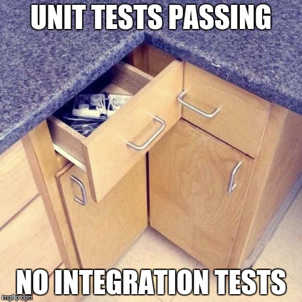

# **POC demo front-end tests**

This project is a very tiny app based on react, redux with typescript that only contains
an input with a decrement and increment buttons. Based on this, there are some tests, from unit tests to end-to-end tests.

It has been created with [create-react-app](https://reactjs.org/docs/create-a-new-react-app.html) so it already comes with few common packages.

This README.md is not explaining how the differents tests are made in the application, but it's explaining what part are tested and why. Each of the libs I'm using here are really well documented, and you should give them a look to have a better understanding of how what they are providing can help us to have a better and safer codebase

## **Getting started**

```bash
git clone git@github.com:Newpoki/poc-demo-ut.git
cd poc-demo-ut
yarn install #npm run install
yarn start #npm run start
```

## **Which tests should I write in my app and why ?**

In a React application, we're trying to apply DRY and so, writting components, hooks, utils functions that are meant to be reused across the whole app. So it's important to be sure that they are working well by themselves and that's where `unit tests` comes. BUT, we can't only check them independently, we must be sure that they still work once putted together, and that's why we end up writting `integration tests` and `e2e tests`.



## **Unit tests**

### **Functions**

This is maybe the easiest case. Those functions are pure JS. Utils functions are meant to be re-used across the app, and must be as simple as possible, so I think it's a really good idea to get them tested.

See `src/utils/tests/getActualDate.test.ts` to get more informations.

### **Redux**

The redux part is managed with [RTK (redux toolkit)](https://redux-toolkit.js.org/) as every modern redux app should.

The redux part of this app is in `src/redux`

In a redux app, we have few things, but not every of them are revelant to test:

- **actions** &rarr; The action are created by redux-toolkit slices. If they change, there will be an error in the components that dispatch them and the app will not start at all with typescript. So, IMHO, testing is not revelant.

- **selectors** &rarr; The selectors access the app store and return the specified data. Typescript allow us to avoid accessing an unexistant value, but let us accessing the wrong path. This must be tested. (See `src/redux/counter/tests/counterSelectors/selectCount.test.ts`)

- **reducers** &rarr; This is the main part that will update the data, this are the most importants part of the redux app. This must be tested. (See `src/redux/counter/tests/counterReducer.test.ts`);

### **Custom hooks**

Hooks are an important part of modern react applications as they let us create more easily re usable code and get rid of HOC-ception hell. The problem with hook testing, is that they're meant to be used inside react functional components, which is not really trivial with [Jest](https://jestjs.io/).

But nowadays, this is not a big deals anymore as a really talented guy named `Kent C Dodds` created `react-testing-library` (we'll see more about this later), with another sub lib name `react-testing-library/hooks`. In CRA applications, the required libs are already installed.

See `src/hooks/tests/useGetLocalizedActualDate.test.ts` file to check what is easily doable with this library.

## Integration tests

As said previously for [Custom hooks tests](#custom-hooks), `react-testing-library` allow us to write integration tests for a component. IMHO, we could, but we shouldn't test EVERY single components in the application with this lib. Only those who are re-used, UI components for exemple, like Buttons, Checkboxes, Input etc.

See `src/components/tests/Button.test.tsx` or `src/App.test.tsx` for exemple.

**NB**: In `src/App.test.tsx`, I'm misleading myself by testing what could be a huge components (App.tsx) instead of directly testing the Button component. This is only to show what we could do. Ladies and gentlemen, don't try this at home.

## End to End tests

I do not have any experience with end to end tests, but there is some well known tools like [selenium](https://www.selenium.dev/), [robot framework](https://robotframework.org/) and [cypress](https://www.cypress.io/). After checking differencies, I think that `cypress` is the best tool for front-end developer, as it makes us write Javascript, syntax looks like `Mocha`, `Enzyme` and `Jest` libs.

Also, there is a dashboard where we can replay test step by step, check what failed, with some screenshot, works on any browser installed on the user computer.

Cypress is used by a lot of developpers, maintained, the documentation is insanely well written, I really think this is the lib to go with in order to have some really good E2E tests.
In top of this, the `Typescript` implementation is near perfect.

As opposed to integration tests, the E2E tests shouldn't, IMHO, focus on little component them self, but on the whole screen itself. I think that the E2E test should reflect the user stories. A bit like cucumber for backend tests

See `cypress/integration/App_spec.ts` for what is possible to do.

### Installation

```bash
yarn add -D cypress @cypress/react @cypress/webpack-dev-server html-webpack-plugin@4 eslint-plugin-cypress
```

### Config

```javascript
  /** cypress/tsconfig.json */

  {
    "compilerOptions": {
      "target": "es5",
      "lib": ["es5", "dom"],
      "types": ["cypress"]
    },
    "include": ["**/*.ts"]
  }
```

```javascript
  /** cypress/eslintrc.json */

  {
    "root": true,
    "plugins": ["cypress"],
    "env": {
      "cypress/globals": true
    },
    "extends": ["plugin:cypress/recommended"]
  }
```
